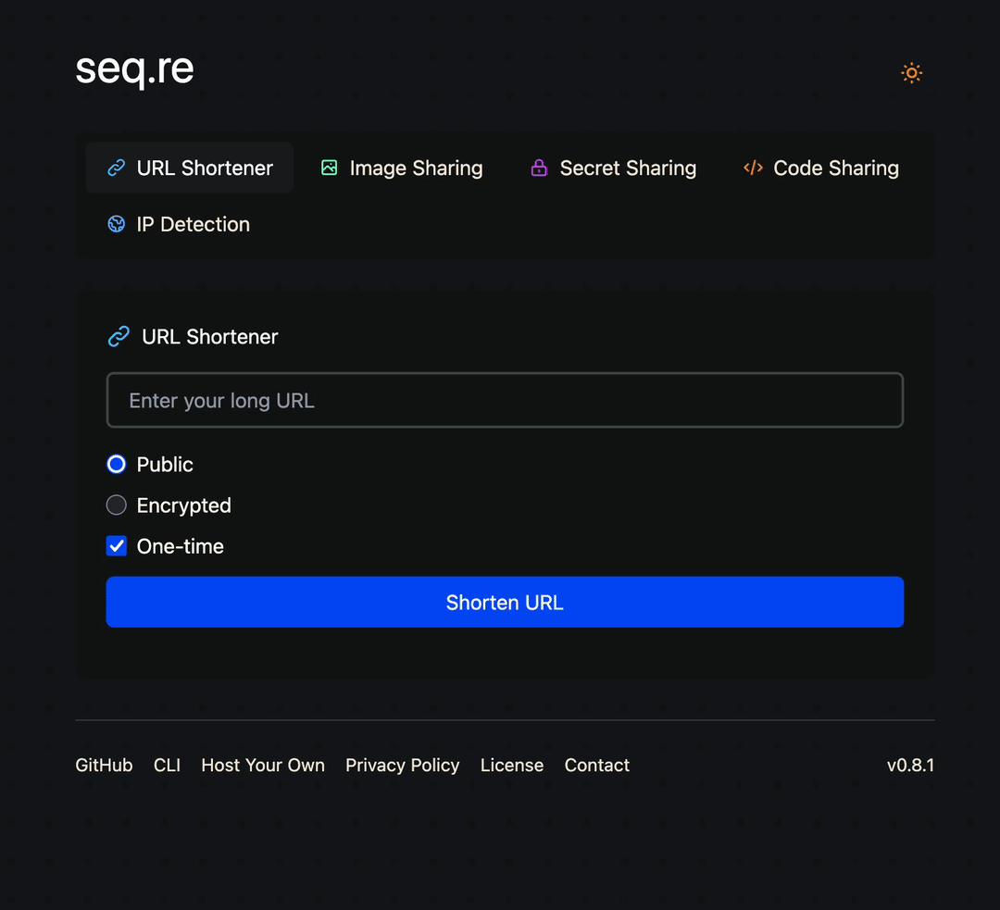

# seq.re

[](https://goreportcard.com/report/github.com/piheta/seq.re)
[](https://github.com/piheta/seq.re/actions/workflows/test.yml)
[](https://github.com/piheta//actions/workflows/lint.yml)
[](https://github.com/piheta/seq.re/security/code-scanning)

A self-hostable collection of everyday utilities — URL shortening, IP lookup, secret, image and code sharing — without the ads, telemetry, or third-party dependencies.

**Try it out:** [https://seq.re](https://seq.re)

## Features

- **URL Shortening** - Create short, unique 6-character codes for long URLs with automatic 7-day expiration
- **Secret Sharing** - Create one-time use encrypted links for sensitive text
- **Image Sharing** - Upload and share images with optional encryption and one-time viewing
- **Code Sharing** - Share code snippets with syntax highlighting support and optional encryption
- **IP Detection** - Lookup your IP with support for proxied requests (X-Forwarded-For, X-Real-IP)
- **End-to-End Encryption** - Optional client-side encryption for URLs, images, and pastes
- **One-Time Resources** - Auto-delete links, images, secrets, or pastes after first access
- **Encrypted KV Database** - Embedded key-value store with automatic TTL-based expiration
- **Web Interface** - Web UI with support for all features
- **CLI Tool** - Full-featured command line interface with clipboard integration



## Server Deployment

### With Database Encryption (AES-256)
```bash
# Generate a random 32-byte (256-bit) encryption key
openssl rand -hex 32

# Use the generated key
docker run -p 8080:8080 \
    -v ./data:/data \
    -e REDIRECT_HOST=https://your-seqre-server.com \
    -e REDIRECT_PORT=:8443 \
    -e BEHIND_PROXY=true \
    -e DB_ENCRYPTION_KEY=your_64_character_hex_key_here \
    piheta/seqre:latest
```

### Environment Variables

| Variable | Default | Description |
|----------|---------|-------------|
| `REDIRECT_HOST` | `http://localhost` | Base URL for shortened links |
| `REDIRECT_PORT` | `:8080` | Port suffix for URLs (use `:443` or empty for standard ports) |
| `BEHIND_PROXY` | `false` | Set to `true` when behind Cloudflare/Nginx to trust proxy headers |
| `DATA_PATH` | `/data/seqre` | Database storage path |
| `DB_ENCRYPTION_KEY` | - | Optional: 32/48/64 hex chars for AES-128/192/256 encryption |
| `CONTACT_EMAIL` | - | Optional: Contact email displayed in web UI footer |

**Important:** Store the encryption key securely! Without it, your database cannot be decrypted.

## CLI

### Install

```bash
brew tap piheta/seqre
brew install seqre
```

Or download binaries [here](https://github.com/piheta/seq.re/releases)

### Usage

```bash
Usage: seqre <command> [args]
Commands:
  ip                                                              Get your IP address
  url <URL> [--encrypted] [--onetime]                             Create a shortened URL
  url get <short> [key]                                           Expand a shortened URL
  secret <text>                                                   Create an encrypted secret
  secret get <short> <key>                                        Retrieve and decrypt a secret
  img <file> [--encrypted] [--onetime]                            Upload an image
  img get <short> [key]                                           Download an image
  paste <file> [--language <lang>] [--encrypted] [--onetime]      Upload a paste
  paste get <url|short> [key]                                     Retrieve a paste
  config set <server>                                             Set the server URL
  config get                                                      Get the server URL
  config clipboard <on|off>                                       Enable/disable auto-copy to clipboard
  version                                                         Show version information
```
